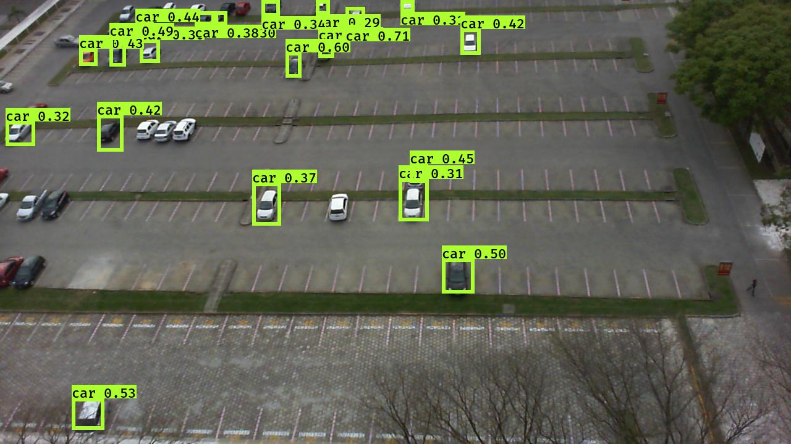

## Parking lot detection

### Train your own yolov3 and generate a custom model

In order to easily generate my own yolov3 model, I used a project called [TrainYourOwnYOLO](https://github.com/AntonMu/TrainYourOwnYOLO),
available in github (last time checked 23/02/2021).

To avoid missing a core part of this project, I copied a version of the same project to my repository.

Steps to make a custom yolov3 model:

- [Image Annotation](TrainYourOwnYOLO/1_Image_Annotation) 
- [Training](TrainYourOwnYOLO/2_Training)

### Use the model to identify anything you want

I used this approach essentially because all the pre-trained models were not giving me good results with a low resolution dataset of images.

Also the objects that I was trying to identify are in an aerial view which makes it even harder.

So with my custom model, with only 59 training images, I was able to get results like this:

### Used libraries

[opencv-python](https://pypi.org/project/opencv-python) - version 4.5.1.48